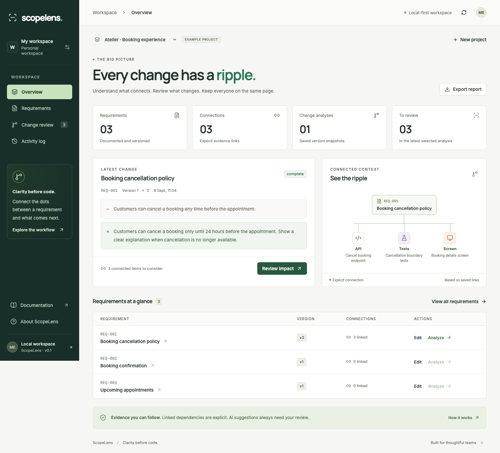
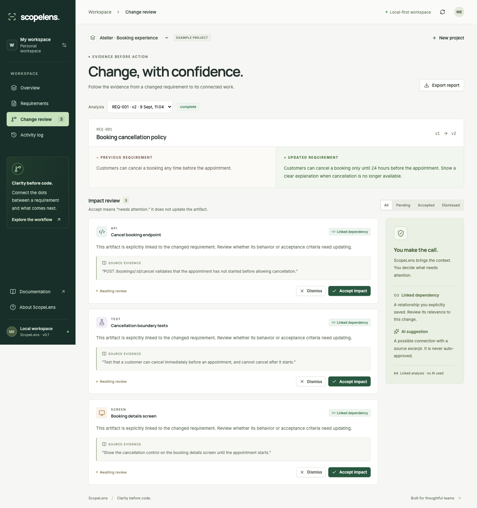

<div align="center">

# ScopeLens
### Every change has a ripple.
An evidence-first workbench for requirement changes.

**React · TypeScript · NestJS · PostgreSQL · Human-reviewed AI**

[](https://github.com/mr-kumuditha/scopelens/actions/workflows/ci.yml)

</div>

ScopeLens helps a small project owner answer: **“This requirement changed. Which connected work should I review, and what evidence supports the connection?”**

A cancellation policy changing from “before the appointment” to “24 hours before” may affect an API rule, a boundary test, and a screen. ScopeLens versions the requirement, follows saved relationships, and presents reviewable impacts. It does not silently modify code or treat model output as fact.

> **Portfolio project:** ScopeLens demonstrates a practical software-engineering workflow: versioning a business rule, modelling its relationships, enforcing concurrency rules on the server, and keeping AI output reviewable by people.

## Why ScopeLens

| Challenge in a small team | How ScopeLens handles it |
|---|---|
| A client changes one sentence | Preserves a before/after version snapshot with a reason for the change |
| The impact is unclear | Follows direct, evidence-linked API, test, and screen artifacts |
| Two people edit outdated information | Rejects stale version writes with optimistic concurrency checks |
| AI suggests an unsupported connection | Requires a valid supplied artifact and exact source quotation before showing it |
| A previous review is no longer current | Locks new review decisions when the requirement has changed again |

## Product flow

```text
Brief → reviewed requirement → evidence link → saved version → analysis → human review → audit history
```

The product is intentionally focused: it helps a user reason about a change before implementation work begins. It does not automatically alter code, tests, or external systems.

## Live public demo

Open the public fictional demo at **[scopelens-three.vercel.app](https://scopelens-three.vercel.app)**.

It uses resettable in-memory sample data because serverless instances do not provide a shared durable database. It is suitable for viewing the interface, the fictional Atelier example, and the deployed health status. **Do not enter real project or personal information.** A persistent hosted handover requires external PostgreSQL through `DATABASE_URL`; the Desktop/local version already supports embedded PGlite or external PostgreSQL.

## Run locally

Use **Node.js 24** (see `.nvmrc`).

```sh
npm ci
npm run dev
```

Open **http://127.0.0.1:5173**. The API listens on port 4000. No database server, Docker, or AI key is required. Embedded PostgreSQL persists in `.data/scopelens`.

Choose **Explore example** to load the explicitly fictional Atelier booking scenario, or create your own project. The sample is opt-in and has no real customer data.





## What works in this release

- Projects with an original brief, source-based or optional AI drafts, and evidence-linked requirement cards.
- Reviewed requirement entry, immutable historical versions, change reasons, and optimistic concurrency.
- API, test, screen, and related-requirement artifacts with explicit evidence links.
- Background change analysis against the two latest saved versions.
- Linked-impact snapshots, optional AI suggestions, source quotation validation, and version staleness.
- Accept, dismiss, and reopen review; decisions are audit logged.
- Project switching, requirement search, analysis selection, review filtering, history, and JSON export.
- Responsive interface, locally served fonts, Lucide icons, keyboard controls, modal focus handling, and reduced-motion support.
- Single-owner access-token gate for hosted use; production startup refuses a missing or short token.

## Architecture at a glance

```text
React + TypeScript interface
            │
            ▼
NestJS HTTP API ──► ScopeService rules and transactions
            │                     │
            ▼                     └──► optional hosted AI suggestions
PostgreSQL / embedded PGlite
```

The default setup uses embedded PGlite so the project runs without a separate database service. It can use external PostgreSQL through `DATABASE_URL`. The complete design and tradeoffs are in the [architecture guide](docs/ARCHITECTURE.md).

## Scope boundaries

This is a **single-owner MVP**, not a multi-tenant team service. It has no accounts, team roles, invitations, or billing. Requirement drafts always require human review before saving. Source-based drafting works without AI; optional AI drafting requires provider configuration. Analysis follows direct saved links, not repository code or transitive dependencies. Accepting an impact means “needs attention”; it does not edit its artifact. JSON export is an inspection/report format, not a backup restore facility.

The optional AI integration requires `AI_API_KEY` and `AI_MODEL`. Without them, linked analysis is fully usable and the UI never claims AI ran. Hosted-provider behavior must be verified with your own configured provider before making claims about model quality. See [limitations and roadmap](docs/ROADMAP.md).

## Documentation

| Document | What you learn |
|---|---|
| [User guide](docs/USER_GUIDE.md) | Complete workflow, example walkthrough, interpretation of evidence |
| [Architecture](docs/ARCHITECTURE.md) | Boundaries, data model, transactions, worker lifecycle, tradeoffs |
| [API reference](docs/API.md) | Requests, responses, errors, and access |
| [Design system](docs/DESIGN_SYSTEM.md) | Colors, typography, components, responsive and accessible behavior |
| [Testing](docs/TESTING.md) | Automated checks and evidence limits |
| [Deployment](docs/DEPLOYMENT.md) | Local production build, Docker, PostgreSQL, and secrets |
| [Decision records](docs/DECISIONS.md) | Why this architecture and what would change at scale |
| [Roadmap](docs/ROADMAP.md) | Implemented features versus deliberate next steps |
| [Interview guide](docs/INTERVIEW_GUIDE.md) | Demo narrative and honest CV wording |
| [Validation record](docs/VALIDATION.md) | Checks actually performed for this build |

## Commands

```sh
npm run typecheck   # TypeScript checks
npm test            # Database-backed domain tests and AI output validation
npm run build       # Frontend + compiled backend
npm start           # Serve built UI and API together on port 4000
npm run test:e2e     # Running dev app required; uses installed Google Chrome
npm run test:production # Built server smoke test in an isolated temporary database
```

`npm run dev` starts two processes. Use Ctrl+C in that terminal to stop this application's processes. Never run two API instances against the same embedded database directory.

## Optional external database

Copy `.env.example` to `.env` and set `DATABASE_URL` to a PostgreSQL connection string. The same SQL schema and parameterized queries are used by both adapters. Application tables are created if missing; there are no destructive migrations. Use a dedicated database.

## Optional AI

Configure `AI_API_KEY`, `AI_MODEL`, and optionally `AI_BASE_URL` for an OpenAI-compatible chat-completions provider, then restart the API. **Analyze with AI** appears in Change review. It sends the before/after requirement and up to 30 unlinked artifacts to that provider. Direct links are always captured first; provider failure preserves them. Secrets remain server-side.

The model returns possible connections, not authoritative conclusions. Exact-quote validation establishes provenance, not semantic truth. No autonomous external actions occur.

## Validation

The local validation record includes:

- 13 database-backed domain tests for versions, evidence validation, stale reviews, cross-project boundaries, and AI-output filtering.
- 4 Google Chrome workflows covering project creation, draft review, change analysis, persistence, responsive layout, and accessibility checks.
- Production smoke checks for the access-token guard, security headers, invalid requests, cross-origin rejection, and restart persistence.
- Zero known dependency vulnerabilities at the time of the final audit.

See the precise scope, date, and unverified areas in [VALIDATION.md](docs/VALIDATION.md). The project is not represented as a deployed production service or an externally evaluated AI system.

## Project structure

```text
src/                 React UI, types, local fonts, responsive design
server/main.ts       HTTP controller, access gate, validation errors, bootstrap
server/service.ts    Business rules, transactions, versioning, analysis lifecycle
server/database.ts   Embedded/external PostgreSQL adapters and initial schema
server/ai.ts         Optional provider adapter and evidence validator
tests/               Domain tests and browser workflows
docs/                Product, engineering, handover, and validation documentation
```

The complete interview-ready handbook is [docs/ScopeLens-Project-Handbook.pdf](docs/ScopeLens-Project-Handbook.pdf). It includes product diagrams, screenshots, architecture, validation evidence, deployment boundaries, and interview-panel answers.

No deployment, usage numbers, or internship outcomes are claimed by this repository.
