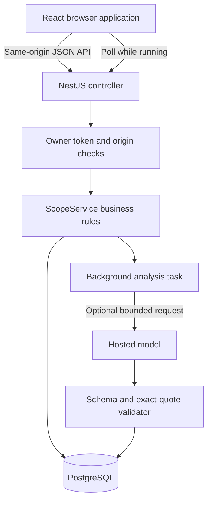
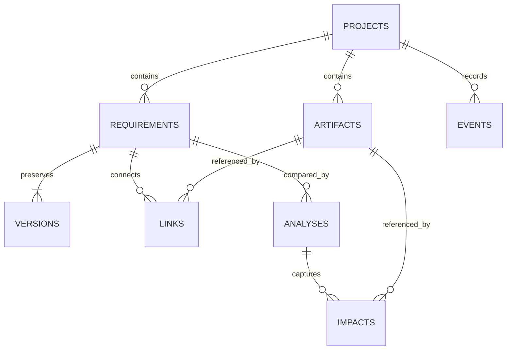
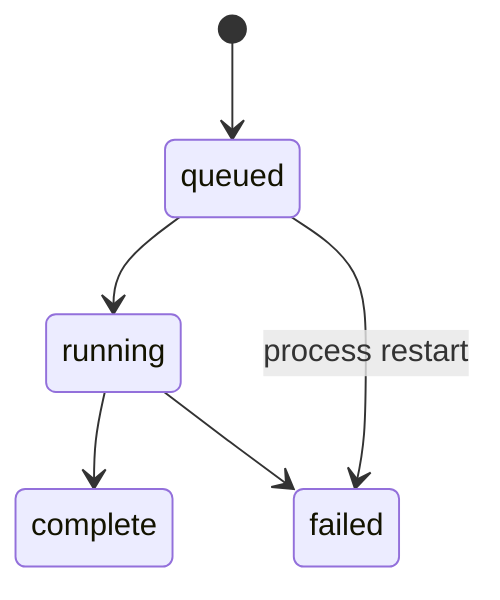

# Architecture

## Product boundary

One owner works across several projects in one server deployment. All projects are available to that owner. A project ID scopes relationships; it is not a user-authorization boundary. Remote access uses one shared owner token. Do not describe this as multi-tenancy.

The access middleware runs before the controller in the implementation; the diagram groups these conceptual responsibilities. The frontend is served by Vite in development and by the API server after build. Fonts are bundled locally.

## Logical responsibilities

- HTTP: validated route inputs, bounded JSON request bodies, same-origin use, secure headers, errors.
- Requirements: original evidence, current version, immutable historical rows.
- Relationships: typed artifacts and direct links with exact evidence quotations.
- Analysis: record before/after and version, snapshot linked impacts, invoke optional model, persist result state.
- Review: reject outdated analyses, record explicit decisions and their audit events.

These responsibilities currently share a compact service. This is a modular-monolith foundation, not a claim that each responsibility is already a separate Nest module. Split by feature when the service grows; keep transaction ownership explicit.

## Data model

Requirements store a current title/body and integer version. Versions have a unique `(requirement_id, version)` constraint. Links have a unique `(requirement_id, artifact_id)` constraint. Foreign keys prevent dangling references. Scope checks prevent cross-project links. SQL parameters bind untrusted values; identifiers are never interpolated from user input.

An artifact with kind `requirement` is a descriptive artifact, not an automatic edge to another requirement row. Transitive traversal is outside v0.1.

## Edit transaction

1. Validate title, body, reason, and expected version.
2. Lock the current requirement row.
3. Compare expected and stored version. Reject a mismatch with HTTP 409.
4. Increment current version, append its historical row, and append the audit event.
5. Commit all three changes together.

Source excerpts must exactly match part of the saved original brief. On later changes, that source records the requirement's origin; the version reason records why behavior diverged from that original source.

## Analysis lifecycle

The creation transaction captures the two latest requirement bodies and all existing direct-link impacts. A separate asynchronous task sets `running`, captures up to 30 unlinked artifacts, optionally requests model suggestions, and completes the record. Captured evidence is copied into each impact, so later reads show what was analyzed.

AI requests have a 30-second timeout and 1,800-token output cap. Up to 12 suggestions are accepted. Each must reference an eligible supplied artifact and quote an exact substring from its description; duplicates are discarded. Each artifact description is limited to 4,000 characters. Context caps limit input size but do not define a fixed monetary budget.

One active analysis per project is allowed. A process restart marks unfinished jobs failed. Jobs are persisted but not automatically retried; a user explicitly reruns them. This avoids hidden model spending.

## Staleness and review

An analysis is stale when its recorded requirement version differs from the current version. Review mutations recheck this server-side. Old accepted/dismissed decisions remain historical, and new decisions require a new analysis. Accept means a human believes an artifact needs attention; it does not update the source artifact.

## Storage and concurrency

Default: PGlite, an embedded PostgreSQL engine, persists to `.data/scopelens`. Optional: `pg` connects through `DATABASE_URL`, with one pool connection. A process-local promise queue serializes database operations and transaction sequences, preventing overlapping transactions on that connection. This favors correctness and simplicity for a small single-owner application.

Run **one API process**. Horizontal scaling is unsupported: process-local coordination and job claiming are not safe across replicas. Before scaling, adopt a dedicated connection per transaction, database-backed atomic job claims, migrations, and distributed concurrency tests.

## Failure behavior

- Invalid fields: HTTP 400 with useful validation messages.
- Unknown or wrong-project record: HTTP 404.
- Stale edits, duplicate links, or outdated review: HTTP 409.
- Provider failure: failed analysis with preserved direct impacts, plus an audit event.
- Malformed provider JSON: fail analysis, preserve direct impacts.
- Unmatched suggestion citations: discard those suggestions.
- No dependencies: show an empty result with an explicit limit statement.

## Security boundary

Loopback development has no login. Hosted/production startup requires an owner token of at least 32 characters. The browser keeps that token in session storage. All project routes check it; health exposes only readiness and capability metadata. Use HTTPS at the reverse proxy, avoid third-party scripts, and never expose development mode publicly. This is not enterprise authentication or a security audit. Account-based access and roles are future work.
